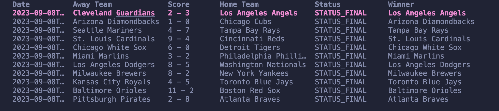

# MLB Scores CLI ⚾
MLB Scores CLI is a command-line application that allows you to view Major League Baseball scores for today, yesterday, or any specified date after Opening Day 2002 (API doesn't have data beyond this). Powered by [Charm's Bubble Tea framework](https://charm.sh), the app displays game results in a styled table inside the terminal.


## Example Output




## Features 🚀

- **View Today's Scores:** Get a list of games played today.
- **View Yesterday's Scores:** Check yesterday's MLB game results.
- **Specify a Date:** Fetch scores for any valid date in YYYY-MM-DD format (e.g., `2023-10-28`).


## Commands

- `mlb-scores today` to display MLB scores from today
- `mlb-scores yesterday` to display MLB scores from yesterday
- `mlb-scores YYYY-MM-DD` to display MLB scores from a specified date


## Installation and Running the Application

1.  To install this run the command 
```bash
go install github.com/codytheroux96/mlb-scores/cmd/mlb-scores@v1.3.0
```
2. Once this installs head on over to [balldontlie.io](https://balldontlie.io) and create a free account where you will get an API key.
3. With the API key add `export MLB_API_KEY=<your-api-key>` to your shell profile (bashrc or zshrc):
    - Don't forget to `source ~/.bashrc` or `source ~/.zshrc` after you've added the API key.
    - Restart your terminal once done.
    - If you want to check that this worked you can run `echo $MLB_API_KEY` if on Linux/Mac or `echo %MLB_API_KEY%` if on Windows.
4. Now you can run the project using the `mlb-scores` command mentioned previously in this readme. 


## More To Come

- Adding more fields into the table (that I already have in my models) and updating the look of the table as well.


## Contributing 🤝
1. Fork the repository.
2. Create a new branch: `git checkout -b feature/your-feature`
3. Make your changes and commit them
    - `git add .`
    - `git commit -m "descriptive message"`
4. Push the branch: `git push origin feature/your-feature`.
5. Submit a pull request.


## Acknowledgments 🙏
- Thanks to [Charm](https://charm.sh) for their excellent CLI tools.
- Thanks to [balldontlie.io](https://balldontlie.io) for providing MLB data.
- Thanks to devkevbot for the [inspiration](https://github.com/devkevbot/who-scored).
