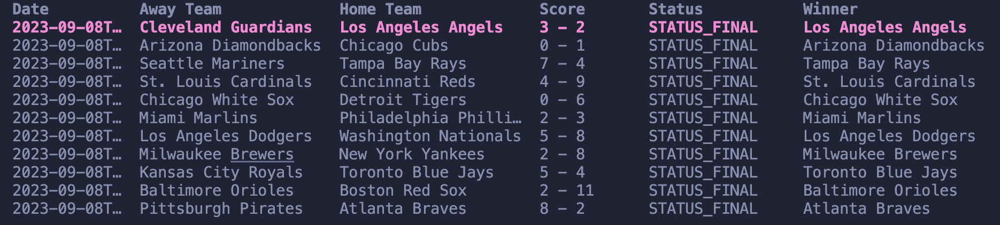

# MLB Scores CLI ⚾
MLB Scores CLI is a command-line application that allows you to view Major League Baseball scores for today, yesterday, or any specified date. Powered by [Charm's Bubble Tea framework](https://charm.sh), the app displays game results in a styled table.

## Example Output

## Features 🚀

- **View Today's Scores:** Get a list of games played today.
- **View Yesterday's Scores:** Check yesterday's MLB game results.
- **Specify a Date:** Fetch scores for any valid date in YYYY-MM-DD format (e.g., `2023-10-28`).

## Commands

- `mlb-scores today` to display MLB scores from today
- `mlb-scores yesterday` to display MLB scores from yesterday
- `mlb-scores YYYY-MM-DD` to display MLB scores from a specified date

## Installation and Running the Application

1.  To install this run the command `go install github.com/codytheroux96/mlb-scores/cmd/mlb-scores@v1.0.0`
2.  Once this installs head on over to [balldontlie.io](https://balldontlie.io) and create a free account where you will get an API key
3. In the root of this project create a `.env` file and add `API_KEY=<your-API-key-here>` 
4.  Now you can run the project using the `mlb-scores` command mentioned previously in this readme. Unfortunately at this time you can ONLY run those commands successfully while you have the project open

## More To Come

- Currently you can only run the commands while you are in the project. I need to fix this so that you can run any of the `mlb-scores` commands outside of the project.

## Contributing 🤝
1. Fork the repository.
2. Create a new branch: `git checkout -b feature/your-feature`
3. Make your changes and commit them
4. Push the branch: `git push origin feature/your-feature`
5. Submit a pull request.

## Acknowledgments 🙏
- Thanks to [Charm](https://charm.sh) for their excellent CLI tools.
- Thanks to [balldontlie.io](https://balldontlie.io) for providing MLB data.
